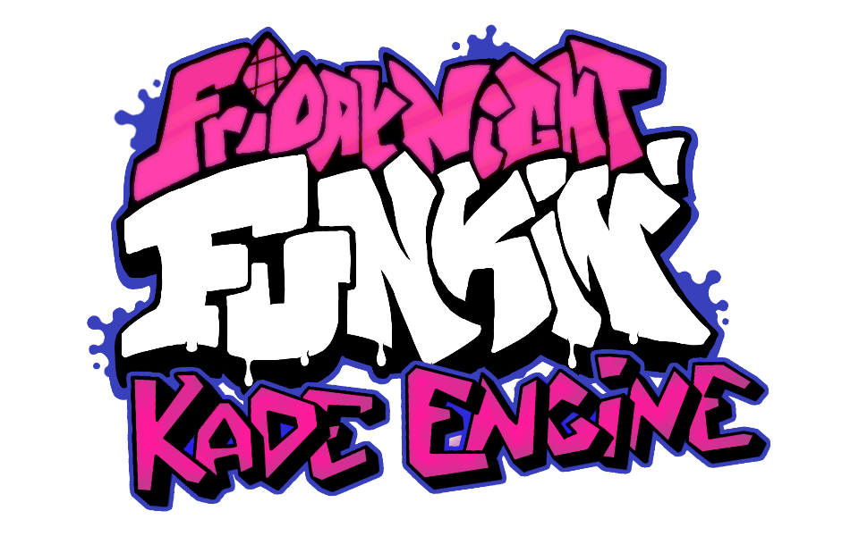

I beg you, for the love all things holy and graceful, if you plan to make your own mods of this game, DON'T fucking use KadeEngine for the charting.
Just DON'T

Or if you simply MUST(like I did because like an idiot I hard-coded all of my bullshit into the engine), NEVER try and use the god-forsaken copy + paste function, cause it just DOESN'T function. 
I swear, the fucking charting system just sometimes forgets that those pasted notes exist, or sometimes doubles, or triple pastes all the notes, so it eventually
crashes the unstable peice of shit. 
And forget about re-loading a Kade-Engine chart that has ANY copy+pasting because those notes just DON'T fucking exist anymore lmao

What a fucking trash-fire.
Is this what I get for my hurbis?
Is this what I deserve for daring to believe?
Is this my retribution for attempting to create something by myself?